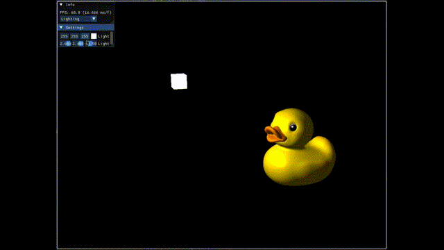

# OpenGL Playground

my learning journey.

## Source:

- [hg_sdf](https://mercury.sexy/hg_sdf/)

## Ref:

[Mike Shah Introduction to OpenGL](https://www.youtube.com/playlist?list=PLvv0ScY6vfd9zlZkIIqGDeG5TUWswkMox)

[Victor Gordan OpenGL Tutorials](https://www.youtube.com/playlist?list=PLPaoO-vpZnumdcb4tZc4x5Q-v7CkrQ6M-)

[Procedural 3D Engine. Ray Marching OpenGL Tutorial](https://www.youtube.com/watch?v=hUaYxqkrfjA)
